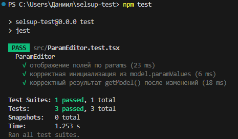

Запуск:
npm install
npm test
npm run dev

Вывод тестов:

 PASS  src/ParamEditor.test.tsx
  ParamEditor
    √ отображение полей по params (23 ms)
    √ корректная инициализация из model.paramValues (6 ms)
    √ корректный результат getModel() после изменений (18 ms)

Test Suites: 1 passed, 1 total
Tests:       3 passed, 3 total
Snapshots:   0 total
Time:        1.253 s
Ran all test suites.